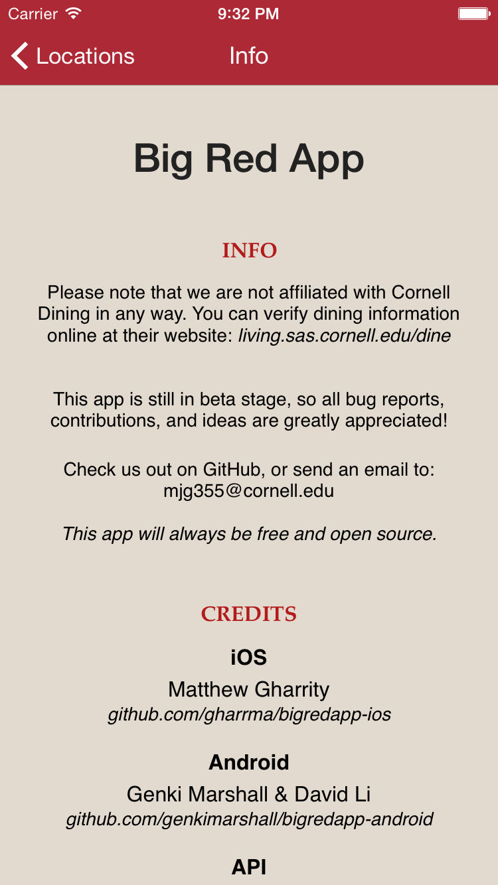
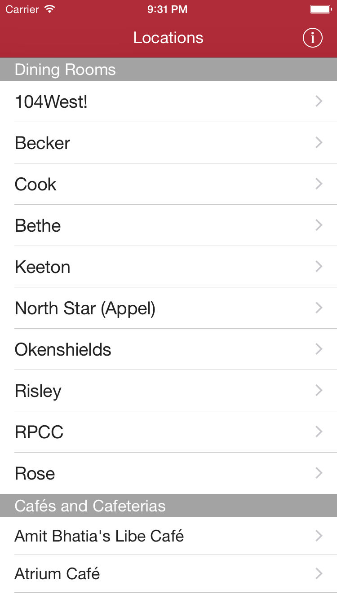
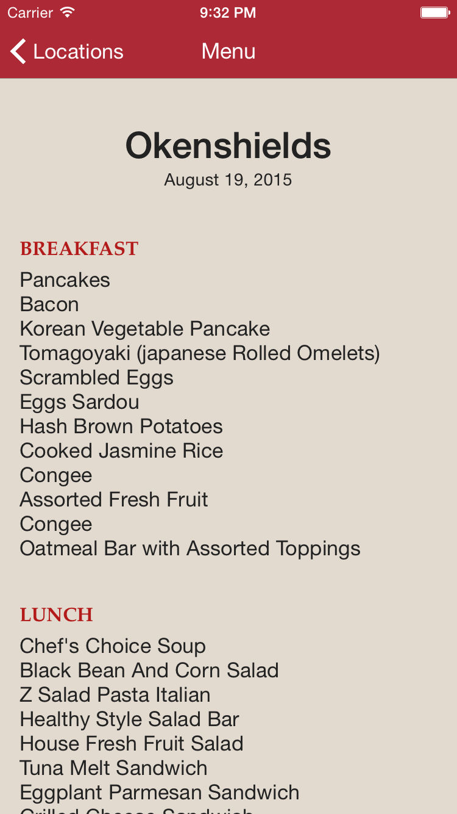

# Big Red App for iOS

## Update
Just as this app was being reviewed for the App Store, Cornell released its own API and web app [here](https://now.dining.cornell.edu/eateries), making this app rather obsolete. Progress on the app will end, but the code will remain, waiting for a new purpose...

## Photos

## Summary
Yes, this is the iOS version of [Genki Marshall's](https://github.com/genkimarshall) [Big Red App](https://github.com/genkimarshall/bigredapp-android). As such, its goals are very similar.
* It's still a pain to find Cornell University dining hall info on the phone, so this is the iOS app to help with that.
* We are using [Kevin Chavez](https://github.com/mrkev)'s API [here](http://redapi-tious.rhcloud.com/).

## Objectives
* Free and open source.
* Native iOS app: easy to use, good looking, minimal, clean.
* Code: well-commented and easy to maintain.

## Contributing
* [Pull requests](http://git-scm.com/book/en/v2/GitHub-Contributing-to-a-Project) are very welcome! Do not hesitate if you are a beginner, as I would be more than happy to give an overview of the project, or even iOS development in general.

## General App Structure
* All source files are in the "Big Red App" directory.
* JSONRequests handles all requests for JSON objects from the RedAPI, and it helps parse these objects in order to display menus.
* LocationTable displays a list of dining locations.
* DiningView displays the menu for a particular dining location.
* CafeView displays info for a particular café location.
* Menu contains classes to represent menus and menu items.
* Tools defines a few constants shared between classes (threads, colors, and more).
* ErrorHandling provides several custom errors, and handy methods for displaying errors on-screen.
* The UI structure/layout is housed in Main.storyboard, a standard nib file (in the Base.lproj directory).

## Other
* [Facebook group for OpenSourceCornell](https://www.facebook.com/groups/opensourcecornell)
* Questions? Feel free to email me (Matthew Gharrity): mjg355
